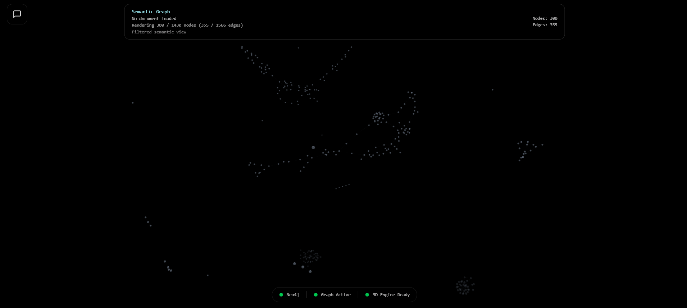
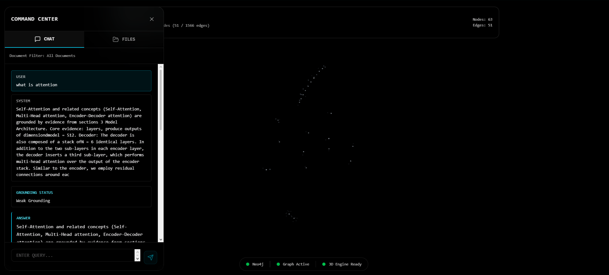
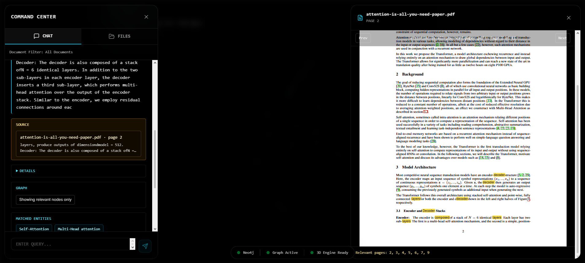

# MindMap-AI — Semantic Research Copilot


Upload academic PDFs, explore their knowledge as a 3D semantic graph, and ask evidence-backed questions grounded in extracted entities, relations, and source passages.

---

## Preview







---

## Why this exists

Academic PDFs often contain dense relationships between methods, datasets, concepts, authors, and claims.

Traditional PDF readers show pages. Chat-based summarizers often flatten the document into a single answer.

MindMap-AI explores a graph-first reading workflow: extract structured knowledge from a PDF, preserve evidence, and let the user inspect the document as a semantic graph.

---

## What It Does

MindMap-AI turns a PDF into an inspectable graph-based reading environment:

1. **Ingest** — Upload a PDF. The pipeline parses it, extracts typed entities and relations via LLM, normalizes them to a canonical graph, and persists everything to Neo4j.
2. **Explore** — An interactive 3D force-graph renders the knowledge graph. Nodes are entities (Method, Concept, Dataset, Author…); edges are typed relations. Click a node to inspect its evidence, citations, and canonical links.
3. **Query** — Ask a question. The semantic query pipeline traverses the graph, collects evidence passages, ranks them, and composes a grounded answer with citation chips and PDF page jumps.
4. **Read** — Click a citation to open the source PDF at the exact page, with the relevant passage highlighted.

---

## Engineering notes

- The project models document understanding as a graph problem instead of a flat summary problem.
- Extracted relations are reified as first-class nodes to preserve provenance and evidence.
- Query answering traverses the graph and ranks evidence before composing an answer.
- The active semantic path is graph-based; embeddings are not used in the active query path.
- The deployment is designed as a portfolio/research demo, not a hardened multi-tenant SaaS system.

---

## Limitations

- Extraction quality depends on PDF structure, OCR quality, and document complexity.
- The graph is generated from model-assisted extraction and may require human review for critical use.
- The live demo is intended for portfolio/research usage, not production document management.
- PDF storage currently uses a demo static access model.
- Large documents may require stricter rate limits, queueing, and storage isolation in production.

---

## Tech Stack

| Layer | Technology |
|-------|-----------|
| **LLM** | OpenAI GPT-4.1 (extraction + semantic QA composition helpers) |
| **Embeddings** | Not used in active semantic path (legacy compatibility only) |
| **Graph DB** | Neo4j (AuraDB in production) |
| **Backend** | FastAPI + LangChain + Poetry |
| **Frontend** | Next.js 16, React 19, Zustand |
| **3D Graph** | Three.js + react-force-graph-3d |
| **PDF Viewer** | react-pdf v9 with text-layer highlight |
| **Deploy** | Render (backend) + Vercel (frontend) |

---

## Architecture

```
PDF → DocumentParser → PassageSplitter → SectionDetector
    → LLMExtractor → ExtractionPipeline
    → EntityNormalizer → RelationNormalizer → CanonicalNormalizer → EntityLinker
    → GraphWriter → Neo4j

Query → QuestionInterpreter → CandidateSelector → TraversalPlanner
      → SemanticQueryReader → EvidenceRanker → EvidenceClusterer
      → InsightBuilder → AnswerComposer
```

Graph model uses a **reified relation pattern** for provenance:
```
(source)-[:OUT_REL]->(RelationInstance)-[:TO]->(target)
(Evidence)-[:SUPPORTS]->(RelationInstance)
(Evidence)-[:FROM_PASSAGE]->(Passage)
(CanonicalEntity)<-[:INSTANCE_OF_CANONICAL]-(Entity)
```

Full contract: [`docs/graph_contract.md`](docs/graph_contract.md)

---

## API Endpoints

| Method | Path | Description |
|--------|------|-------------|
| `POST` | `/api/ingest` | Upload and ingest a PDF |
| `GET` | `/api/ingest/{job_id}` | Poll ingest job status |
| `GET` | `/api/graph/semantic` | Fetch graph (nodes/edges/meta) |
| `GET` | `/api/graph/node/{id}` | Node detail with evidence and citations |
| `POST` | `/api/query/semantic` | Grounded semantic Q&A |

---

## Local Setup

### Prerequisites

- Python 3.10+
- Node.js 18+
- Neo4j instance (local or [AuraDB free tier](https://neo4j.com/cloud/platform/aura-graph-database/))
- [OpenAI API key](https://platform.openai.com/api-keys)

### 1. Install

```bash
git clone https://github.com/your-username/mindmap-ai.git
cd mindmap-ai
poetry install
cd frontend && npm install && cd ..
```

### 2. Configure

```bash
cp backend/.env.example .env
```

```env
NEO4J_URI=bolt://localhost:7687
NEO4J_USERNAME=neo4j
NEO4J_PASSWORD=your_password

OPENAI_API_KEY=sk-...
SEMANTIC_API_KEY=change_me_for_shared_env
```

### 3. Run

```bash
# Backend
poetry run uvicorn backend.app.main:app --reload

# Frontend (separate terminal)
cd frontend && npm run dev
```

### 4. Seed demo graph (optional)

```bash
poetry run python backend/tools/seed_smoke_graph.py
```

---

## Tests & Quality

```bash
# Backend (161 tests)
poetry run pytest backend/tests

# Frontend unit (58 tests)
cd frontend && npm test

# E2E smoke (6 tests)
cd frontend && npm run test:e2e

# Semantic eval
poetry run python backend/tools/run_semantic_eval.py
```

| Metric | Result |
|--------|--------|
| Backend tests | 161 / 161 passed |
| Frontend tests | 58 / 58 passed |
| E2E tests | 6 / 6 passed |
| Intent accuracy | 100% |
| Hallucination rate | 0% |
| Evidence presence | 74% |
| Insight presence | 89% |

Semantic eval metrics are measured on deterministic project fixtures, not a broad external benchmark.

---

## Deployment Positioning

This project is a deployed research demo with production-oriented safeguards in progress.

- Current deployment is suitable for portfolio/demo workloads.
- Production hardening still planned: auth enforcement, stronger rate-limits, stricter upload controls, and storage access isolation.

## Storage & PDF Access

PDF files are currently served from a demo static mount (`/static/...`) for same-origin UX simplicity.

- This is intentionally a demo-storage contract.
- Production target is stricter access control (signed URLs, user isolation, scoped file access policy).

## Model Provider Truth Source

Active runtime truth is in backend services:

- `backend/app/services/ingestion/semantic_ingestion_service.py`
- `backend/app/services/extraction/llm_extractor.py`

If docs and code ever diverge, code is authoritative for active runtime behavior.

---

## Project Structure

```
backend/
  app/
    api/          # FastAPI routers
    core/         # DB connection, config
    domain/       # Identity and ID generation
    schemas/      # Pydantic request/response models
    services/
      extraction/ # LLM extraction pipeline
      graph/      # Neo4j writers
      ingestion/  # Ingest job orchestration
      normalization/
      parsing/    # PDF parsing, passage splitting
      query/      # Semantic query pipeline
  evals/          # Deterministic eval fixtures
  tests/          # Unit + integration tests
  tools/          # Eval runner, seed scripts

frontend/
  app/
    components/   # SemanticGraphViewer, CommandCenter, Inspector, FileLibrary…
    lib/          # API client, types, constants
    store/        # Zustand global state
  tests/e2e/      # Playwright smoke tests
```

---

## Docs

| Document | Purpose |
|----------|---------|
| [`docs/architecture.md`](docs/architecture.md) | Service layers, pipeline, touch list |
| [`docs/graph_contract.md`](docs/graph_contract.md) | Graph pattern (authoritative) |
| [`docs/ontology_v1.md`](docs/ontology_v1.md) | Entity and relation types |
| [`docs/extraction_contract.md`](docs/extraction_contract.md) | Extraction I/O schema |
| [`docs/status.md`](docs/status.md) | Sprint history and checklist |
